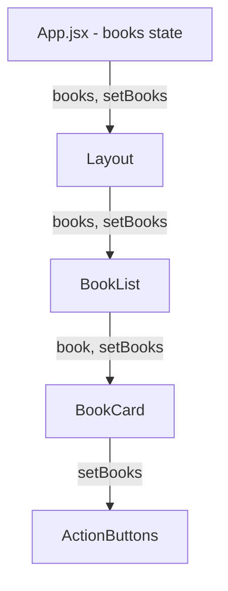
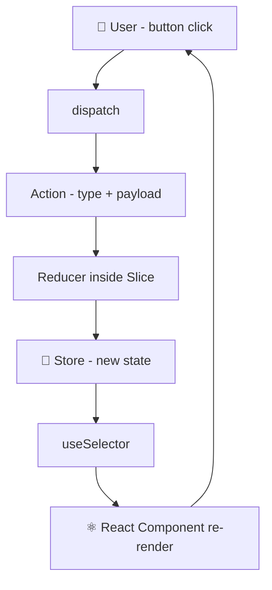
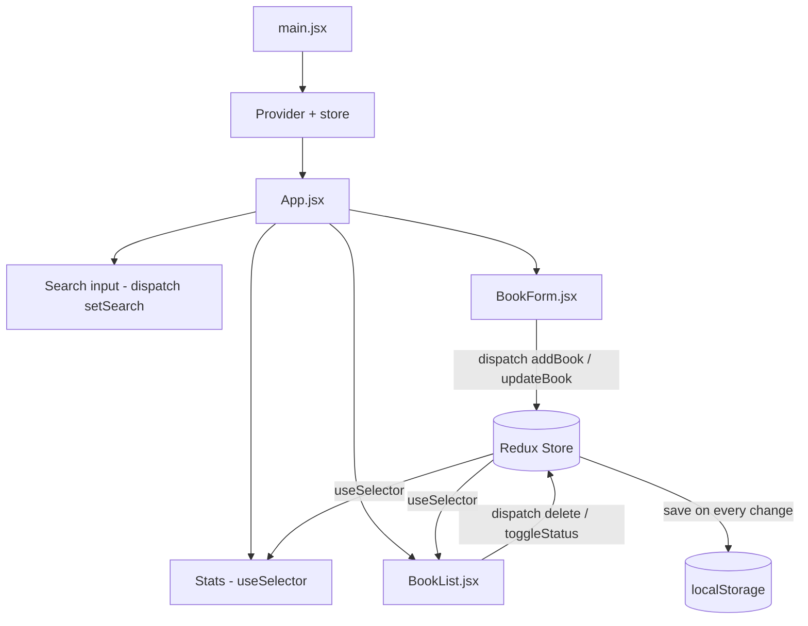
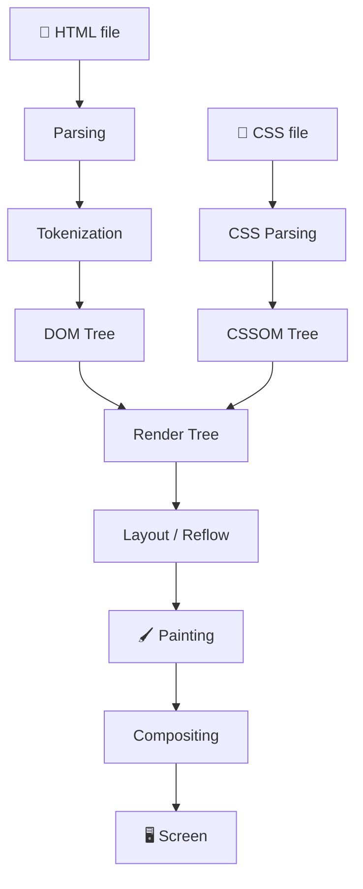
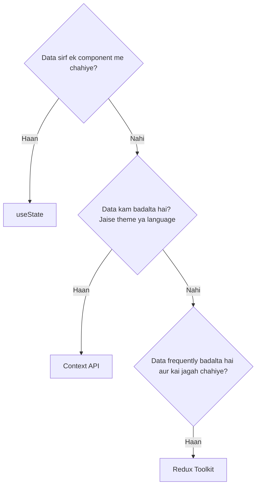

# 🚀 Redux Toolkit – My Learning Journey

**Mini Hackathon Submission**
*Sheryians Coding School – Cohort 3.0*

> Project: **Book Library Management System**


## 1. Introduction

Jab maine Redux Toolkit ke baare me pehli baar suna tab mujhe laga ye sirf Redux ka ek aur naya version hoga, naam thoda fancy hai bas. Lekin documentation explore karne ke baad samajh aaya ki iska asli purpose Redux ko **easy** aur **less boilerplate** banana hai.

### What is Redux Toolkit?

Redux Toolkit (short me **RTK**) Redux ki official, recommended way hai state manage karne ki. Simple words me — ye ek **toolbox** hai jisme Redux ke saare zaroori tools pehle se ready milte hain: store banana, reducers likhna, actions generate karna, immutable updates — sab kuch.

Pehle plain Redux me ek chhoti si feature ke liye bhi 4-5 files banani padti thi:

- action types ki file
- action creators ki file
- reducer ki file
- constants ki file

Redux Toolkit me ye sab ek hi **slice** file me aa jaata hai. Mere liye yahi sabse bada relief tha.

### Why I started learning it

Main apne React projects me `useState` use karta tha, aur wo chhote projects me bilkul theek chal raha tha. Problem tab shuru hui jab ek hi data (jaise books ki list) 3-4 alag components me chahiye tha. Main props pe props pass karta gaya aur code ganda hota gaya. Tab lagaa ki ab kuch proper seekhna padega — aur Redux Toolkit ka naam har jagah aa raha tha.

### My first impression

Honestly? Thoda darr laga. `store`, `slice`, `reducer`, `dispatch`, `selector` — ek saath itne naye words. Lekin jab maine ek chhota sa counter banaya RTK se, tab 15 minute me hi click ho gaya. Mujhe laga tha ye bohot heavy hoga, but actually ye kaafi predictable aur clean hai.

### What I expected before learning

| Meri Expectation (before) | Reality (after) |
| --- | --- |
| Redux bohot complex hoga | Concepts sirf 5-6 hain, baaki repeat hai |
| Bohot saara boilerplate likhna padega | RTK ne 70% boilerplate hata diya |
| Sirf bade apps me kaam aata hai | Medium apps me bhi life easy karta hai |
| State mutate nahi kar sakte, tough hoga | Immer ki wajah se `state.list.push()` normally likh sakte hain |

---

## 2. Why Redux Toolkit?

### What problem does `useState` solve?

`useState` React ka sabse basic state tool hai. Ek component ke andar ka data — jaise input field ki value, modal open hai ya nahi, loading true hai ya false — iske liye `useState` perfect hai.

```jsx
const [title, setTitle] = useState("");
```

Simple, fast, aur zero setup. Mere `BookForm.jsx` me aaj bhi form ke inputs `useState` se hi chal rahe hain, kyunki wo data sirf usi form ka hai.

### Where `useState` becomes difficult

Problem tab aati hai jab **same data multiple components** ko chahiye.

Mere project me `books` list ye sab jagah chahiye thi:

- `App.jsx` → stats dikhane ke liye (Total / Available / Issued)
- `BookList.jsx` → cards render karne ke liye
- `BookForm.jsx` → edit karte waqt

Agar main `useState` App me rakhta, to har child ko props se bhejna padta, aur har update function bhi props se bhejna padta.

### Prop Drilling

Prop drilling matlab — data ko upar se neeche tak har component se **paas karte jaana**, chahe beech wale components ko us data ki zaroorat ho ya na ho.



Yahan `Layout` ko `books` ki koi zaroorat hi nahi hai, phir bhi wo sirf "postman" ban gaya. Ye 2 level tak theek lagta hai, 4 level pe irritating ho jaata hai.

### Why Redux Toolkit exists

Redux ka idea simple hai: **saara shared data ek jagah rakho (store), aur jis component ko chahiye wo seedha wahan se le le.** Koi postman nahi, koi drilling nahi.

Redux Toolkit isliye bana kyunki plain Redux sahi tha lekin likhne me lamba tha. RTK ne usme ye add kiya:

- `configureStore()` — DevTools + thunk pehle se setup
- `createSlice()` — reducer + actions ek saath
- **Immer** built-in — mutable jaisa code likho, immutable result milta hai

### Redux vs Redux Toolkit

| Point | Plain Redux | Redux Toolkit |
| --- | --- | --- |
| Store setup | `createStore` + manual middleware | `configureStore()` – ek line |
| Action types | Manually constants banao | Slice se auto-generate |
| Action creators | Har action ke liye function likho | `slice.actions` se free milte hain |
| Reducer | `switch-case` lamba | `createSlice` ke andar chhote functions |
| Immutability | Manually spread `{...state}` | Immer handle karta hai |
| DevTools | Manually configure | Default on |
| Files per feature | 3-4 files | 1 slice file |
| Beginner friendly? | Thoda nahi | Haan, kaafi |

> 💡 Meri simple line: **Redux = engine, Redux Toolkit = engine + steering + AC, ready to drive.**

---

## 3. Core Concepts

### 🔹 State

**Definition:** State matlab app ka current data — is waqt screen pe jo bhi dikh raha hai uske peeche ka data.

**Example (mere project ka actual state):**

```js
{
  books: {
    list: [
      { id: 1, title: "Atomic Habits", author: "James Clear", status: "issued" }
    ],
    search: ""
  }
}
```

**Real-world analogy:** Library ka register. Us register me abhi kaunsi book available hai, kaunsi issue ho chuki hai — wahi library ka "state" hai.

---

### 🔹 Store

**Definition:** Store ek single JavaScript object hai jisme poore app ka Redux state rehta hai. Ise **single source of truth** kehte hain.

**How Store works:**

1. Store state ko hold karta hai
2. Components store ko "subscribe" karte hain
3. Jab action dispatch hota hai, store reducer chalata hai
4. Naya state banta hai, aur subscribed components re-render ho jaate hain

**Example (`src/redux/store.js`):**

```js
import { configureStore } from "@reduxjs/toolkit";
import booksReducer from "./booksSlice";

export const store = configureStore({
  reducer: {
    books: booksReducer,
  },
});
```

**Analogy:** Store = library ka **main counter**. Sab log wahin jaate hain book lene ya jama karne.

---

### 🔹 Slice

**Definition:** Slice ek feature ka pura Redux logic hai — uska initial state, uske reducers, aur usse bane actions — sab ek file me.

**Purpose:** Code ko feature-wise organise karna. Books ka logic `booksSlice.js` me, cart ka `cartSlice.js` me.

**Example:**

```js
import { createSlice } from "@reduxjs/toolkit";

const booksSlice = createSlice({
  name: "books",
  initialState: { list: [], search: "" },
  reducers: {
    addBook(state, action) {
      state.list.push({ id: Date.now(), ...action.payload });
    },
    deleteBook(state, action) {
      state.list = state.list.filter((b) => b.id !== action.payload);
    },
  },
});
```

**Analogy:** Slice = ek pizza ka slice. Pura pizza (app state) ke andar ka ek hissa, jo apne aap me complete hai.

---

### 🔹 Reducer

**Definition:** Reducer ek **pure function** hai jo current state aur action leta hai, aur naya state return karta hai.

**Simple explanation:** Reducer ek rule book hai — "agar ye action aaya, to state ke saath ye karna hai." Bas itna. Na API call, na `Math.random()`, na `Date.now()` (ideally) — sirf state update.

**Example:**

```js
toggleStatus(state, action) {
  const book = state.list.find((b) => b.id === action.payload);
  if (book) {
    book.status = book.status === "available" ? "issued" : "available";
  }
}
```

> ⚠️ Yahan `book.status = ...` likhna normally galat hota (mutation), lekin RTK ke andar **Immer** chal raha hai jo isse safely immutable update me convert kar deta hai.

---

### 🔹 Actions

**Definition:** Action ek plain object hota hai jo batata hai ki **kya hua**. Usme ek `type` hota hai aur optionally `payload`.

**Example:**

```js
{ type: "books/addBook", payload: { title: "Ikigai", author: "Hector Garcia" } }
```

RTK me ye object manually nahi banana padta:

```js
export const { addBook, deleteBook, toggleStatus } = booksSlice.actions;

dispatch(addBook({ title: "Ikigai", author: "Hector Garcia" }));
```

**Analogy:** Action = library me bhara hua **request form**. "Mujhe ye book issue karni hai" — form batata hai kya karna hai, kaam counter (reducer) karta hai.

---

### 🔹 Provider

**Definition:** `Provider` react-redux ka component hai jo store ko poore React tree me available kara deta hai.

**Purpose:** Iske bina koi bhi component `useSelector` ya `useDispatch` use nahi kar sakta — error aayega.

```jsx
import { Provider } from "react-redux";
import { store } from "./redux/store";

ReactDOM.createRoot(document.getElementById("root")).render(
  <Provider store={store}>
    <App />
  </Provider>
);
```

**Analogy:** Provider = building ka **main WiFi router**. Router on hai to har room me internet mil jaayega, alag alag cable nahi bichani padegi.

---

### 🔹 `useSelector()`

**Definition:** Hook jo store se data **read** karta hai.

**How it works:** Aap ek chhota function dete ho jo pura state leta hai aur usme se jo chahiye wo return karta hai. Jab wo particular value badalti hai, component re-render hota hai.

```js
const books = useSelector((state) => state.books.list);
const search = useSelector((state) => state.books.search);
```

> 🧠 Tip jo maine seekha: `useSelector` me hamesha **chhota piece** select karo. Pura `state.books` select karoge to search type karne pe bhi list wale component re-render honge.

---

### 🔹 `useDispatch()`

**Definition:** Hook jo store ko action **bhejne** ka function deta hai.

**How it works:** `useDispatch()` call karke `dispatch` function milta hai, phir `dispatch(action)` karke change trigger karte ho.

```js
const dispatch = useDispatch();

<button onClick={() => dispatch(deleteBook(book.id))}>Delete</button>
```

| Hook | Kaam | Direction |
| --- | --- | --- |
| `useSelector` | Data padhna | Store → Component |
| `useDispatch` | Change bhejna | Component → Store |

---

## 4. Redux Toolkit Data Flow



### Step by step explanation

1. **User** — Sab kuch user se shuru hota hai. Mere app me user "Issue" button dabata hai.
2. **Dispatch** — Button ka `onClick` `dispatch(toggleStatus(book.id))` call karta hai. Dispatch ka matlab hai "store, ye message le lo".
3. **Action** — Dispatch ke andar jo jaata hai wo action object hai: `{ type: "books/toggleStatus", payload: 2 }`. Ye sirf **describe** karta hai ki kya hua, khud kuch change nahi karta.
4. **Reducer** — Store us action ko sahi reducer tak pahuchata hai. Reducer decide karta hai naya state kya hoga — yahan book ka status flip ho jaata hai.
5. **Store** — Store me naya state save ho jaata hai. Purana state replace ho gaya. Yahi ab single source of truth hai.
6. **useSelector** — Jin components ne us data ko subscribe kiya tha, unhe naya value milta hai.
7. **React Component** — Component re-render hota hai aur UI me "Issue" ab "Return" dikhne lagta hai.

> 🔁 Ye flow hamesha **one direction** me chalta hai. Isi wajah se bugs dhoondhna easy hota hai — pata hota hai data kis raste se aaya.

---

## 5. Folder Structure

Mere `local-app` project ka structure:

```text
local-app/
├── index.html              # Entry HTML, isme root div hai
├── package.json            # Dependencies aur scripts
├── vite.config.js          # Vite + React + Tailwind config
├── README.md               # Project documentation
└── src/
    ├── main.jsx            # React ka entry point + Provider
    ├── App.jsx             # Main page (stats, search, form, list)
    ├── index.css           # Global styles + Tailwind
    ├── components/
    │   ├── BookForm.jsx    # Add / Edit book form
    │   └── BookList.jsx    # Books ke cards + actions
    └── redux/
        ├── store.js        # Store setup
        └── booksSlice.js   # Books ka pura logic + localStorage
```

### Har file kya karti hai

| File | Kaam |
| --- | --- |
| `index.html` | Sirf ek `<div id="root">` deta hai jahan React mount hota hai |
| `vite.config.js` | Vite ko batata hai ki React aur Tailwind plugins use karne hain |
| `src/main.jsx` | App ko DOM pe render karta hai aur `<Provider store={store}>` wrap karta hai |
| `src/App.jsx` | Page ka layout — heading, stats bar, form, search input, list |
| `src/index.css` | Tailwind import + meri custom classes (`.book-card`, `.stats`, etc.) |
| `src/components/BookForm.jsx` | Local `useState` se form fields, submit pe `addBook` ya `updateBook` dispatch |
| `src/components/BookList.jsx` | `useSelector` se books padhta hai, search filter lagata hai, Issue/Edit/Delete buttons |
| `src/redux/store.js` | `configureStore()` se store banata hai aur `books` reducer register karta hai |
| `src/redux/booksSlice.js` | Initial books, saare reducers, aur localStorage save/load logic |

> 📁 Rule jo maine follow kiya: **UI ka code `components/` me, data ka code `redux/` me.** Isse dhoondhna easy ho jaata hai.

---

## 6. Important Functions

| Function | Purpose | Where Used |
| --- | --- | --- |
| `configureStore()` | Store banata hai, DevTools aur middleware auto setup karta hai | `src/redux/store.js` |
| `createSlice()` | Ek feature ka state + reducers + actions ek saath banata hai | `src/redux/booksSlice.js` |
| `Provider` | Store ko poore component tree me available karata hai | `src/main.jsx` |
| `useDispatch()` | Action bhejne ka function deta hai | `BookForm.jsx`, `BookList.jsx`, `App.jsx` |
| `useSelector()` | Store se data read karta hai | `App.jsx`, `BookList.jsx` |
| `slice.actions` | Auto-generated action creators (`addBook`, `deleteBook`…) | Export from `booksSlice.js` |
| `slice.reducer` | Combined reducer jo store me register hota hai | Import in `store.js` |

### Code me kaise dikhte hain

```js
// 1. Slice banaya
const booksSlice = createSlice({ name: "books", initialState, reducers: {...} });

// 2. Actions aur reducer export kiye
export const { addBook, deleteBook } = booksSlice.actions;
export default booksSlice.reducer;

// 3. Store me register kiya
export const store = configureStore({ reducer: { books: booksReducer } });

// 4. Provider se wrap kiya
<Provider store={store}><App /></Provider>

// 5. Component me use kiya
const books = useSelector((s) => s.books.list);
const dispatch = useDispatch();
```

---

## 7. My Mini Project

### 📚 Project Name: **Book Library Management System**

Ek chhota sa library manager jisme books add, edit, delete, issue aur return kar sakte ho. Sab data browser ke `localStorage` me save hota hai, isliye refresh karne pe bhi data rehta hai.

### Features

- ✅ **Add Book** — title, author, genre, year ke saath nayi book add karo
- ✅ **Edit Book** — existing book ki details update karo
- ✅ **Delete Book** — book list se hata do
- ✅ **Issue / Return** — ek click me status toggle (`available` ↔ `issued`)
- ✅ **Search** — title ya author se live filter, case-insensitive
- ✅ **Live Stats** — Total / Available / Issued ka count automatically update
- ✅ **localStorage Persistence** — har change turant save
- ✅ **Default Data** — pehli baar khologe to 3 sample books milengi

### Tech Stack

| Technology | Purpose |
| --- | --- |
| React 19 | UI banane ke liye |
| Vite 7 | Dev server aur build tool |
| Redux Toolkit | State management |
| React Redux | Store ko React se connect karna |
| Tailwind CSS | Styling |
| localStorage | Browser me data save karna |

### Architecture



### Folder Structure

```text
src/
├── main.jsx
├── App.jsx
├── index.css
├── components/
│   ├── BookForm.jsx
│   └── BookList.jsx
└── redux/
    ├── store.js
    └── booksSlice.js
```

### Redux Flow (mere app me actual example)

Maan lo user "Atomic Habits" pe **Return** dabata hai:

1. `BookList.jsx` me button ka `onClick` → `dispatch(toggleStatus(2))`
2. Action banta hai → `{ type: "books/toggleStatus", payload: 2 }`
3. `booksSlice.js` ka `toggleStatus` reducer chalta hai
4. `id === 2` wali book milti hai, status `issued` → `available` ho jaata hai
5. `save(state.list)` localStorage update kar deta hai
6. Store ka naya state ready
7. `App.jsx` ka stats aur `BookList.jsx` dono re-render — Issued count 1 se 0 ho jaata hai

### Key Code – `booksSlice.js`

```js
import { createSlice } from "@reduxjs/toolkit";

const startingBooks = [
  { id: 1, title: "The Midnight Library", author: "Matt Haig", genre: "Fiction", year: 2020, status: "available" },
  { id: 2, title: "Atomic Habits", author: "James Clear", genre: "Self Help", year: 2018, status: "issued" },
  { id: 3, title: "Clean Code", author: "Robert C. Martin", genre: "Technology", year: 2008, status: "available" },
];

function getSavedBooks() {
  const saved = localStorage.getItem("books");
  return saved ? JSON.parse(saved) : startingBooks;
}

function save(books) {
  localStorage.setItem("books", JSON.stringify(books));
}

const booksSlice = createSlice({
  name: "books",
  initialState: { list: [], search: "" },
  reducers: {
    loadBooks(state) {
      state.list = getSavedBooks();
    },
    addBook(state, action) {
      state.list.push({ id: Date.now(), ...action.payload });
      save(state.list);
    },
    updateBook(state, action) {
      const book = state.list.find((b) => b.id === action.payload.id);
      if (book) {
        book.title = action.payload.title;
        book.author = action.payload.author;
        book.genre = action.payload.genre;
        book.year = action.payload.year;
      }
      save(state.list);
    },
    deleteBook(state, action) {
      state.list = state.list.filter((b) => b.id !== action.payload);
      save(state.list);
    },
    toggleStatus(state, action) {
      const book = state.list.find((b) => b.id === action.payload);
      if (book) {
        book.status = book.status === "available" ? "issued" : "available";
      }
      save(state.list);
    },
    setSearch(state, action) {
      state.search = action.payload;
    },
  },
});

export const { loadBooks, addBook, updateBook, deleteBook, toggleStatus, setSearch } = booksSlice.actions;
export default booksSlice.reducer;
```

### 📸 Screenshots

> *(Yahan apne screenshots paste karo)*

| Screen | Screenshot |
| --- | --- |
| Home page with stats | `[ Screenshot placeholder ]` |
| Add book form | `[ Screenshot placeholder ]` |
| Search working | `[ Screenshot placeholder ]` |
| Issued book state | `[ Screenshot placeholder ]` |
| Redux DevTools view | `[ Screenshot placeholder ]` |

---

## 8. Challenges I Faced

Ye wo cheezein hain jinme main actually atka:

**1. Store ka concept samajhna**
Shuru me samajh nahi aa raha tha ki store "kahan" rehta hai. Lagta tha koi file hai jisme data likha jaata hai. Baad me samjha ki ye sirf ek JavaScript object hai jo memory me rehta hai, aur page refresh pe khatam ho jaata hai — isiliye localStorage lagana pada.

**2. Reducer aur Slice me confusion**
Kaafi der tak main dono ko same samajh raha tha. Clear tab hua jab maine socha: **Slice ek container hai, reducers uske andar ke chhote functions hain.** Ek slice me kai reducers ho sakte hain.

**3. State mutate karna galat hai — phir `push` kaise chal gaya?**
Mera sabse bada confusion. Har jagah likha tha "never mutate state", lekin RTK ke examples me `state.list.push()` likha tha. Immer ke baare me padha tab pata chala ki RTK ek draft copy deta hai aur peeche se naya immutable state bana deta hai.

**4. `useSelector` me pura state select kar diya**
Pehle maine `useSelector((state) => state.books)` likha tha. Search box me type karne pe pura list component re-render ho raha tha. Chhote pieces select karne se problem solve hui.

**5. Provider bhoolna**
Ek baar Provider wrap karna bhool gaya aur error aaya: *"could not find react-redux context value"*. 20 minute waste hue, phir samajh aaya Provider ke bina hooks kaam hi nahi karte.

**6. Edit form purani values nahi dikha raha tha**
Edit pe click karta tha to form khaali rehta tha ya purani book ki value dikhati thi. Solution mila `key` prop se — `key={editingBook.id}` dene se React component ko remount kar deta hai aur fresh initial state milti hai.

**7. localStorage aur JSON**
`localStorage` sirf string save karta hai. Pehli baar directly array save kar diya to `[object Object]` mila. `JSON.stringify()` aur `JSON.parse()` ka use zaroori hai.

**8. Documentation padhne ki habit**
Sabse bada change — pehle main seedha YouTube pe tutorial dhoondhta tha. Is hackathon me official docs padhne padi, aur ab lagta hai docs actually zyada clear hote hain videos se.

---

## 9. What I Learned

Personally mujhe lagta hai is project ne mere sochne ka tareeka change kiya:

- Mujhe samajh aaya ki **state ka structure pehle sochna chahiye**, code baad me. Jab maine paper pe likha ki `books` array me kya kya fields hongi, uske baad coding smooth ho gayi.
- **Single source of truth** ka matlab practically samjha. Ab agar count galat aaye to mujhe pata hai ki sirf store check karna hai, 5 alag components nahi.
- **One-way data flow** ki value samajh aayi. Har change dispatch se hota hai, isliye Redux DevTools me poori history dikh jaati hai — kaunsa action kab chala, state pehle kya thi, baad me kya hui. Ye debugging ke liye zabardast hai.
- Seekha ki **har state Redux me daalne ki zaroorat nahi**. Form ke inputs local `useState` me hi theek hain. Redux sirf shared data ke liye.
- **Immer** ki wajah se code likhna bohot natural lagta hai — spread operators ke lambe chains nahi likhne padte.
- Sabse important — **documentation se seekhna aa gaya**. Pehle main har cheez ke liye tutorial dhoondhta tha. Ab main pehle docs kholta hoon.

---

## 10. Real World Use Cases

Redux Toolkit kahan kahan actually use hota hai:

1. **🛒 Shopping Cart** — Cart items, quantity, total price. Cart icon navbar me hai aur product page alag — dono ko same data chahiye.
2. **🔐 Authentication** — Logged-in user info, token, roles. Poore app me har jagah "user kaun hai" pata hona chahiye.
3. **📊 Dashboard** — Filters, date range, selected widgets — sab components sync me rehte hain.
4. **💰 Expense Tracker** — Transactions list, category filters, monthly totals.
5. **🎓 Student Management** — Students ka CRUD, attendance, marks — bilkul mere library project jaisa.
6. **🎨 Theme Management** — Dark/light mode toggle jo poore app pe apply ho.
7. **🔔 Notifications** — Toast messages ka global queue, kahin se bhi trigger ho sakta hai.
8. **📦 Inventory Management** — Stock levels, low-stock alerts, supplier data.
9. **💬 Chat Applications** — Messages, online users, unread counts, active conversation.
10. **📚 Library System (mera project)** — Books, issue/return status, search filter.

> 🎯 Common pattern: jab bhi data **multiple unrelated components** me chahiye aur wo **frequently change** hota hai — Redux Toolkit sahi choice hai.

---

## 11. Browser Rendering Pipeline

Ye Redux ka part nahi hai, lekin isse samajhne se pata chalta hai ki React ka re-render actually screen pe kaise dikhta hai.



### Step by step

| Step | Kya hota hai |
| --- | --- |
| **HTML** | Browser server se HTML file download karta hai |
| **Parsing** | HTML ko line by line padha jaata hai |
| **Tokenization** | Tags ko chhote tokens me toda jaata hai — `<div>`, `</div>`, text |
| **DOM Tree** | Tokens se ek tree structure banta hai — page ka skeleton |
| **CSS → CSSOM Tree** | CSS parse hokar apna alag tree banata hai jisme har element ke styles hote hain |
| **Render Tree** | DOM + CSSOM milkar Render Tree banate hain — sirf **visible** elements (jo `display: none` hain wo nahi aate) |
| **Layout (Reflow)** | Har element ki exact position aur size calculate hoti hai |
| **Painting** | Pixels bharay jaate hain — colors, text, borders, shadows |
| **Compositing** | Alag alag layers ko sahi order me merge karke final screen banti hai |

### React aur Redux is pipeline me kahan aate hain?

Jab main `dispatch(addBook(...))` karta hoon:

1. Store ka state badalta hai
2. `useSelector` naya data deta hai → component re-render
3. React apne **Virtual DOM** me naya tree banata hai
4. Purane Virtual DOM se compare karta hai (**diffing**)
5. Sirf jo change hua wo real DOM me update hota hai
6. DOM change hone se browser ka Layout → Paint → Composite chalta hai

> ⚡ React ka fayda yahi hai — pura page repaint nahi hota, sirf ek naya `<div class="book-card">` add hota hai. Isliye app fast lagti hai.

---

## 12. Redux Toolkit vs Context API vs useState

| Feature | `useState` | Context API | Redux Toolkit |
| --- | --- | --- | --- |
| **Complexity** | Sabse simple, 1 line | Medium — Provider + Context banana padta hai | Thoda zyada — store, slice, provider |
| **Performance** | Best for local state | Value change pe saare consumers re-render | Optimized — selector-based, sirf zaroori components re-render |
| **Scalability** | Chhote components tak hi | Medium apps tak theek | Bade apps ke liye best |
| **Learning Curve** | Bohot easy (1 ghanta) | Easy-medium (half day) | Medium (2-3 din practice) |
| **Boilerplate** | Almost zero | Kam | Kam (plain Redux se bohot kam) |
| **DevTools** | Nahi | Nahi | Haan — time travel debugging |
| **Async handling** | Manual `useEffect` | Manual | `createAsyncThunk` built-in |
| **Best Use Case** | Form inputs, toggles, modals | Theme, language, current user | Shared app data, CRUD, cart, complex state |

### Meri simple decision guide



> 🧩 Important baat jo main pehle nahi samajhta tha: **ye teeno competitors nahi hain.** Mere project me teeno hain — form fields me `useState`, books data me Redux Toolkit, aur `Provider` khud Context API pe hi bana hua hai.

---

## 13. My Notes

> 💡 **Things I should remember before interviews**
>
> - Redux Toolkit Redux ki **official recommended** way hai, koi third-party alternative nahi.
> - Store me poore app ka state ek object me hota hai — **single source of truth**.
> - Reducer hamesha **pure function** hona chahiye — same input pe same output, koi side effect nahi.
> - RTK me mutation-looking code isliye chalta hai kyunki andar **Immer** hai.
> - `createSlice()` action types automatically banata hai: `sliceName/reducerName` (jaise `books/addBook`).
> - `configureStore()` me **Redux DevTools** aur **redux-thunk** by default on hote hain.
> - `useSelector` = read, `useDispatch` = write.
> - `useSelector` me hamesha **smallest possible value** select karo, warna extra re-renders honge.
> - `Provider` ke bina hooks kaam nahi karte — error milega.
> - Redux ka data page refresh pe chala jaata hai — persist karne ke liye `localStorage` ya `redux-persist` chahiye.
> - Async work ke liye `createAsyncThunk` use hota hai, reducer me API call nahi karte.
> - Har state Redux me nahi daalni — local UI state `useState` me hi rakho.

---

## 14. Interview Questions

> Notion me har question ko **toggle block** bana lo — `/toggle` type karke question paste karo, answer andar daal do.

<details>
<summary><b>Q1. Redux Toolkit kya hai?</b></summary>

Redux Toolkit Redux ki official toolkit library hai jo Redux likhna easy banati hai. Isme `configureStore`, `createSlice`, `createAsyncThunk` jaise helpers milte hain jo boilerplate kaafi kam kar dete hain. Aaj ki date me Redux team khud isi ko recommend karti hai, plain Redux ko nahi.
</details>

<details>
<summary><b>Q2. Redux aur Redux Toolkit me kya difference hai?</b></summary>

Redux core library hai. Redux Toolkit uske upar ka wrapper hai. Plain Redux me action types, action creators aur reducers alag alag likhne padte hain aur immutability manually handle karni padti hai. RTK me `createSlice` sab ek saath de deta hai, Immer immutability handle karta hai, aur DevTools + thunk default me mil jaate hain.
</details>

<details>
<summary><b>Q3. Store kya hota hai?</b></summary>

Store ek object hai jisme poore application ka Redux state rehta hai. Ye single source of truth hai. Store ke paas 3 main kaam hote hain — state hold karna (`getState`), action accept karna (`dispatch`), aur changes notify karna (`subscribe`).
</details>

<details>
<summary><b>Q4. Slice kya hai?</b></summary>

Slice ek feature ka pura Redux logic ek jagah hota hai — initial state, reducers, aur auto-generated actions. `createSlice()` se banta hai. Jaise mere project me `booksSlice` me books ka saara logic hai.
</details>

<details>
<summary><b>Q5. Reducer kya hai aur pure function kyun hona chahiye?</b></summary>

Reducer ek function hai jo `(state, action)` leta hai aur naya state return karta hai. Pure hona chahiye taki same input pe hamesha same output mile. Isse testing easy hoti hai, time-travel debugging possible hoti hai, aur unpredictable bugs nahi aate. Isiliye reducer me API calls, `Math.random()` ya `Date.now()` nahi likhna chahiye.
</details>

<details>
<summary><b>Q6. Action aur Action Creator me kya difference hai?</b></summary>

Action ek plain object hai — `{ type: "books/addBook", payload: {...} }`. Action creator ek function hai jo wo object return karta hai. RTK me `createSlice` action creators automatically bana deta hai, `slice.actions` se mil jaate hain.
</details>

<details>
<summary><b>Q7. `dispatch()` kya karta hai?</b></summary>

`dispatch()` action ko store tak bhejta hai. Store us action ko reducers ko pass karta hai, reducer naya state banata hai, aur subscribed components re-render ho jaate hain. Redux me state change karne ka **sirf yahi** tareeka hai.
</details>

<details>
<summary><b>Q8. `useSelector()` kaise kaam karta hai?</b></summary>

`useSelector` store se data read karta hai. Aap ek selector function dete ho, wo state me se specific value nikaalta hai. React-Redux us value ko track karta hai aur jab wo badalti hai (reference comparison se) tab component re-render karta hai.
</details>

<details>
<summary><b>Q9. `Provider` kyun zaroori hai?</b></summary>

`Provider` store ko React context ke through poore component tree me available karata hai. Iske bina `useSelector` aur `useDispatch` store dhoondh nahi paate aur error throw karte hain.
</details>

<details>
<summary><b>Q10. RTK me `state.push()` likhna allowed kaise hai?</b></summary>

Kyunki RTK ke andar **Immer** library chalti hai. Immer aapko original state ka ek "draft" deta hai. Aap draft ko freely mutate karte ho, aur Immer peeche se ek naya immutable state produce kar deta hai. Isliye code mutable dikhta hai lekin actually immutable hai.
</details>

<details>
<summary><b>Q11. `configureStore()` aur purane `createStore()` me kya difference hai?</b></summary>

`createStore()` me middleware aur DevTools manually setup karne padte the. `configureStore()` ye sab default me kar deta hai — redux-thunk middleware, Redux DevTools extension, aur development me immutability/serializability checks. Ye multiple reducers ko automatically combine bhi kar deta hai.
</details>

<details>
<summary><b>Q12. Async API calls Redux Toolkit me kaise handle karte hain?</b></summary>

`createAsyncThunk()` se. Ye automatically teen actions generate karta hai — `pending`, `fulfilled`, aur `rejected`. Inhe slice ke `extraReducers` me handle karke loading, success aur error states manage kar sakte hain. Reducer ke andar direct API call kabhi nahi karte.
</details>

<details>
<summary><b>Q13. Redux Toolkit vs Context API — kab kya use karein?</b></summary>

Context API un cheezon ke liye achha hai jo kam badalti hain — theme, language, current user. Kyunki context value badalne pe saare consumers re-render ho jaate hain. Redux Toolkit tab better hai jab data frequently update hota ho, complex ho, ya aapko DevTools/time-travel debugging chahiye ho.
</details>

<details>
<summary><b>Q14. Kya Redux page refresh ke baad data yaad rakhta hai?</b></summary>

Nahi. Redux store memory me rehta hai, refresh pe reset ho jaata hai. Data persist karne ke liye `localStorage` me manually save karna padta hai (jaise maine apne project me kiya) ya `redux-persist` library use karni padti hai.
</details>

<details>
<summary><b>Q15. Kya har state Redux me daalni chahiye?</b></summary>

Bilkul nahi. Ye common mistake hai. Sirf **shared** ya **global** state Redux me daalo. Form inputs, modal open/close, hover state, dropdown toggle — ye sab local `useState` me hi rakhne chahiye. Warna code unnecessarily complex ho jaata hai.
</details>

<details>
<summary><b>Q16 (bonus). Middleware kya hota hai Redux me?</b></summary>

Middleware action dispatch hone aur reducer tak pahunchne ke beech me chalta hai. Isse logging, async handling, ya action modify karna possible hota hai. `redux-thunk` sabse common middleware hai jo functions dispatch karne deta hai — RTK me ye default aata hai.
</details>

---

## 15. Key Takeaways

- ✅ Redux Toolkit **Redux ka easy version** hai — same power, kam code.
- ✅ Poore app ka shared data **ek store** me rehta hai (single source of truth).
- ✅ `createSlice()` ek feature ka state, reducers aur actions ek file me de deta hai.
- ✅ Data flow hamesha **one direction** me — dispatch → action → reducer → store → component.
- ✅ **Immer** ki wajah se mutable-looking code safely immutable rehta hai.
- ✅ `useSelector` = read, `useDispatch` = write — bas yahi do hooks 90% kaam karte hain.
- ✅ `Provider` ke bina kuch kaam nahi karega.
- ✅ Redux Toolkit `useState` ka **replacement nahi** hai — dono ka apna role hai.
- ✅ Store refresh pe khali ho jaata hai — persistence alag se lagani padti hai.
- ✅ Redux DevTools debugging ko bohot easy bana deta hai.
- ✅ Prop drilling se bachna hi Redux use karne ka sabse practical reason hai.

---

## 16. Conclusion

Hackathon shuru karte waqt mera plan simple tha — Redux Toolkit padhna hai aur ek chhota project banana hai. Lekin jo mila wo isse zyada tha.

Sabse pehle to Redux ka wo darr nikal gaya jo mere andar tha. Pehle mujhe lagta tha ki Redux sirf senior developers ke liye hai aur usme bohot complicated cheezein hoti hain. Ab jab maine khud store banaya, slice likha, action dispatch kiya aur UI ko update hote dekha — tab realise hua ki concepts actually simple hain, bas naam bhaari lagte hain.

Doosri cheez, mera **Book Library Management System** banate waqt maine seekha ki coding ka asli hissa code likhna nahi hai — **socha kya jaaye** ye hai. Jab maine pehle decide kiya ki state me kya kya rakhna hai aur kaunsa data global hoga, tab actual coding sirf 2 ghante me ho gayi.

Teesri aur sabse important baat — **is hackathon ne mujhe documentation independently explore karna sikhaya aur nayi technology seekhne me mera confidence badha diya.** Pehle main har chhoti problem pe tutorial dhoondhta tha. Is baar maine official docs padhi, error messages dhyan se padhe, aur khud solutions nikale. Ye habit aage har technology me kaam aayegi — kyunki har cheez ka tutorial nahi milta, lekin documentation hamesha hoti hai.

Aage main isi project me `createAsyncThunk` add karke real API se data laane ki koshish karunga, aur `redux-persist` bhi try karunga.

> 🙏 Thank you **Sheryians Coding School** for this mini hackathon — it pushed me to learn by doing instead of just watching.

---

*Made with ☕ and a lot of `console.log()` — Cohort 3.0*
